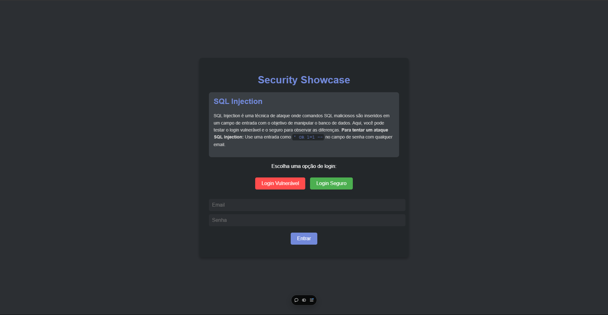

# 🔐 Aplicação de Treinamento em Segurança Web

Este projeto é uma aplicação simples, desenvolvida com **HTML**, **CSS** e **JavaScript**, criada para treinar **proteção contra SQL Injection e XSS** (Cross-Site Scripting). Além disso, explora o uso de **HTTPS** com certificados para garantir uma conexão segura. O objetivo é demonstrar práticas de segurança em autenticação de usuários, comparando exemplos com e sem proteção.

---

## 📸 Pré-visualização

  

---

## 🛠️ Tecnologias Utilizadas

- **Frontend**: HTML, CSS, JavaScript
- **Segurança**:
  - Proteção contra SQL Injection
  - Proteção contra XSS
  - Implementação de HTTPS com certificados SSL

---

## 🔍 Funcionalidades

- Simulação de duas possibilidades de login:
  - **Login sem proteção**: demonstra vulnerabilidades que podem ser exploradas através de SQL Injection e XSS.
  - **Login com proteção**: implementação de técnicas para proteger contra ataques comuns de injeção de SQL e XSS.
- Uso de **HTTPS** para assegurar uma conexão criptografada e segura.

---

## 🛡️ Objetivo do Projeto

- Entender os riscos de segurança comuns em aplicações web.
- Praticar a implementação de proteções contra **SQL Injection** e **XSS**.
- Aprender a configurar **certificados SSL** e forçar o uso de HTTPS.

---

📚 *Projeto desenvolvido para aprimorar conhecimentos em segurança web e proteção de dados de usuários.*
